|      \      |       ECB       |               ECC               |             ECD             |            ECE            |            ECF            |
| :---------: | :--------------: | :-----------------------------: | :-------------------------: | :-----------------------: | :-----------------------: |
| **0** |  |                                |  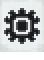  | 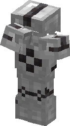 | 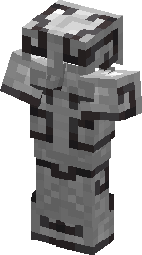 |
| **1** |  |  |  | 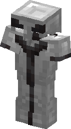 | 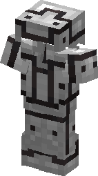 |
| **2** |    |  |    | 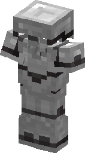 |                          |
| **3** |                  |        |  | 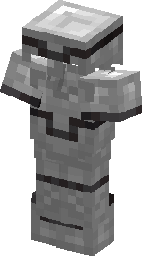 |                          |
| **4** |                  |        |    | 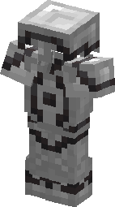 |                          |
| **5** |                  |        |    | 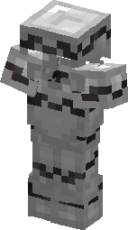 |                          |
| **6** |  |        |    | 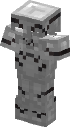 |                          |
| **7** |  |        |    | 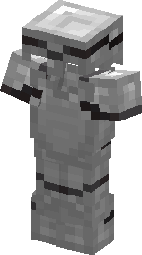 |                          |
| **8** |                  |        |                            | 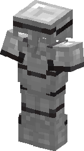 |                          |
| **9** |                  |                                |                            | 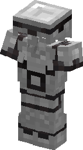 |                          |
| **A** |                  |        |                            | 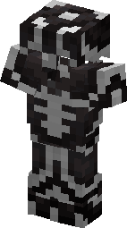 |                          |
| **B** |                  |                                |                            | 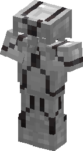 |                          |
| **C** |                  |        |                            | 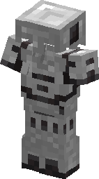 |                          |
| **D** |                  |        |                            | 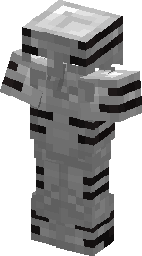 |                          |
| **E** |                  |        |                            | 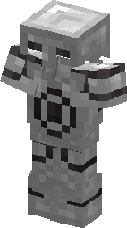 |                          |
| **F** |  |                                |                            | 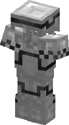 |                          |

|      \      | ED0 | ED1 | ED2 | ED3 |          ED4          |
| :---------: | --- | :-: | :-: | :-: | :-------------------: |
| **0** |     |    |    |    | 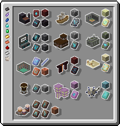 |
| **1** |     |    |    |    |  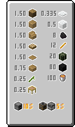  |
| **2** |     |    |    |    |    |
| **3** |     |    |    |    | 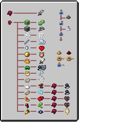 |
| **4** |     |    |    |    |  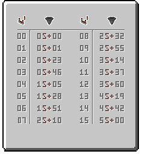  |
| **5** |     |    |    |    |                      |
| **6** |     |    |    |    |                      |
| **7** |     |    |    |    |                      |
| **8** |     |    |    |    |                      |
| **9** |     |    |    |    |                      |
| **A** |     |    |    |    |                      |
| **B** |     |    |    |    |                      |
| **C** |     |    |    |    |                      |
| **D** |     |    |    |    |                      |
| **E** |     |    |    |    |                      |
| **F** |     |    |    |    | 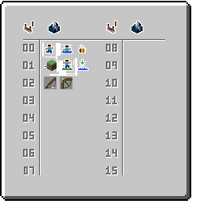 |

---

|      \      |      ECB      |              ECC              |            ECD            |           ECE           |           ECF           |
| :---------: | :------------: | :---------------------------: | :-----------------------: | :---------------------: | :---------------------: |
| **0** | [1](cb0.png "光源") |                              |  [8](cd0.png "旗帜图案 花朵")  | [60](ce0.png "盔甲纹饰 哨兵") | [56](cf0.png "盔甲纹饰 涡流") |
| **1** | [3](cb1.png "红石") | [21](cc1.png "饥饿条 F 0 1, T 0 1") | [11](cd1.png "旗帜图案 苦力怕") | [65](ce1.png "盔甲纹饰 恼鬼") | [52](cf1.png "盔甲纹饰 镶柳") |
| **2** |  [41](cb2.png "钟")  | [20](cc2.png "饥饿条 F 0 2, T 0 2") |  [4](cd2.png "旗帜图案 头颅")  | [68](ce2.png "盔甲纹饰 荒野") |                        |
| **3** |                |    [27](cc3.png "饥饿条 F 1 0")    | [6](cd3.png "旗帜图案 Mojang") | [53](ce3.png "盔甲纹饰 海岸") |                        |
| **4** |                |    [26](cc4.png "饥饿条 F 1 1")    |  [5](cd4.png "旗帜图案 地球")  | [54](ce4.png "盔甲纹饰 沙丘") |                        |
| **5** |                |    [25](cc5.png "饥饿条 F 1 2")    |  [7](cd5.png "旗帜图案 猪鼻")  | [67](ce5.png "盔甲纹饰 向导") |                        |
| **6** | [??](cb6.png "红火") |    [28](cc6.png "饥饿条 F 2 0")    |  [9](cd6.png "旗帜图案 涡流")  | [58](ce6.png "盔甲纹饰 牧民") |                        |
| **7** | [??](cb7.png "蓝火") |    [29](cc7.png "饥饿条 F 2 1")    |  [10](cd7.png "旗帜图案 旋风")  | [61](ce7.png "盔甲纹饰 塑造") |                        |
| **8** |                |    [30](cc8.png "饥饿条 F 2 2")    |                          | [57](ce8.png "盔甲纹饰 雇主") |                        |
| **9** |                |                              |                          | [66](ce9.png "盔甲纹饰 坚守") |                        |
| **A** |                |    [31](cca.png "饥饿条 T 1 1")    |                          | [62](cea.png "盔甲纹饰 幽静") |                        |
| **B** |                |                              |                          | [51](ceb.png "盔甲纹饰 潮汐") |                        |
| **C** |                |    [24](ccc.png "饥饿条 T 2 0")    |                          | [63](cec.png "盔甲纹饰 猪鼻") |                        |
| **D** |                |    [23](ccd.png "饥饿条 T 2 1")    |                          | [59](ced.png "盔甲纹饰 肋骨") |                        |
| **E** |                |    [22](cce.png "饥饿条 T 2 2")    |                          | [55](cee.png "盔甲纹饰 眼眸") |                        |
| **F** | [12](cbf.png "未知") |                              |                          | [64](cef.png "盔甲纹饰 尖塔") |                        |

|      \      | ED0 | ED1 | ED2 | ED3 |         ED4         |
| :---------: | :-: | :-: | :-: | :-: | :-----------------: |
| **0** |    |    |    |    | [32](d40.png "UI 锻造台") |
| **1** |    |    |    |    |  [13](d41.png "UI 炉子")  |
| **2** |    |    |    |    |  [42](d42.png "UI 铁砧")  |
| **3** |    |    |    |    | [2](d43.png "UI 酿造台") |
| **4** |    |    |    |    |  [14](d44.png "UI 漏斗")  |
| **5** |    |    |    |    |                    |
| **6** |    |    |    |    |                    |
| **7** |    |    |    |    |                    |
| **8** |    |    |    |    |                    |
| **9** |    |    |    |    |                    |
| **A** |    |    |    |    |                    |
| **B** |    |    |    |    |                    |
| **C** |    |    |    |    |                    |
| **D** |    |    |    |    |                    |
| **E** |    |    |    |    |                    |
| **F** |    |    |    |    | [40](d4f.png "UI 未完成") |
